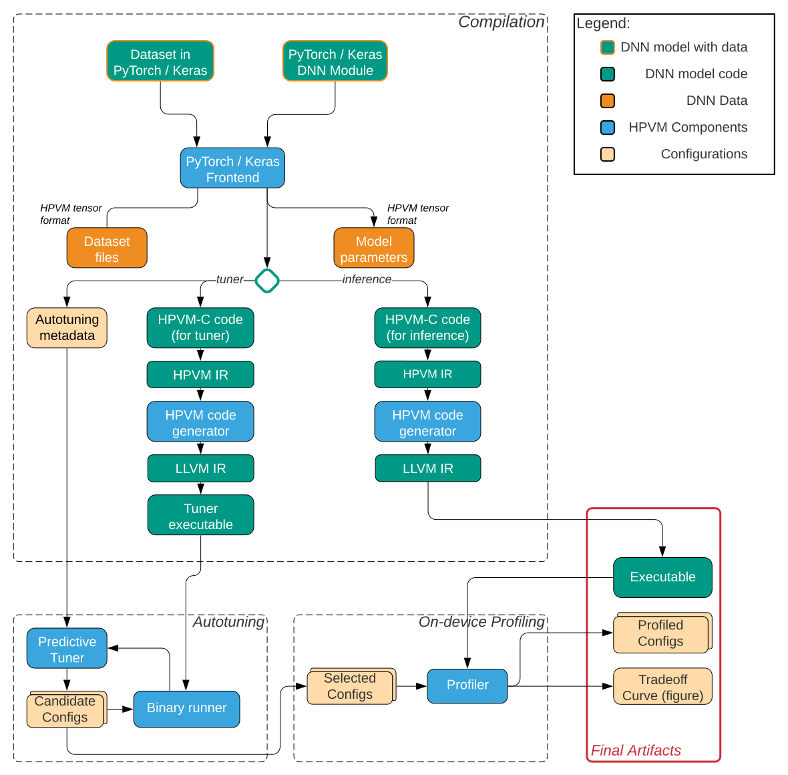

Components
================================

HPVM consists of a few relatively independent key components.

* Frontends (Keras/PyTorch): code generators in Python for lowering Keras and PyTorch
  DNN models into HPVM-C format.
* Patched LLVM: provides HPVM IR and a compilation infrastructure, including ``clang`` and ``opt``.
* HPVM code generator: a few ``opt`` passes that lowers HPVM IR to LLVM IR,
  which is then compiled into object code and binary.
* Predictive tuner: an autotuner library in Python for finding approximation choices (configurations)
  with best performance gain within some loss of Quality of Service (QoS, such as accuracy).
* HPVM profiler: an API in Python for measuring real performance of configurations.
* Tensor runtime: a backend which holds implementations for some common tensor operators
  (such as convolution) that HPVM-C functions can be converted into.

The interaction between these components is illustrated in this figure:

The documentation of these components are listed below,
which explains their role, usage, and other details.

.. toctree::
   :maxdepth: 1

   keras-frontend
   keras-support
   keras-benchmarks
   torch2hpvm
   Predictive Tuner<https://predtuner.readthedocs.io/en/latest/index.html>
   hpvm-profiler

Tests and Benchmarks
--------------------

HPVM provides a number of general benchmarks (written in HPVM-C), DNN benchmarks,
and test cases testing the components listed above.
See this for more details on these tests and benchmarks:

.. toctree::
   :maxdepth: 1

   tests
