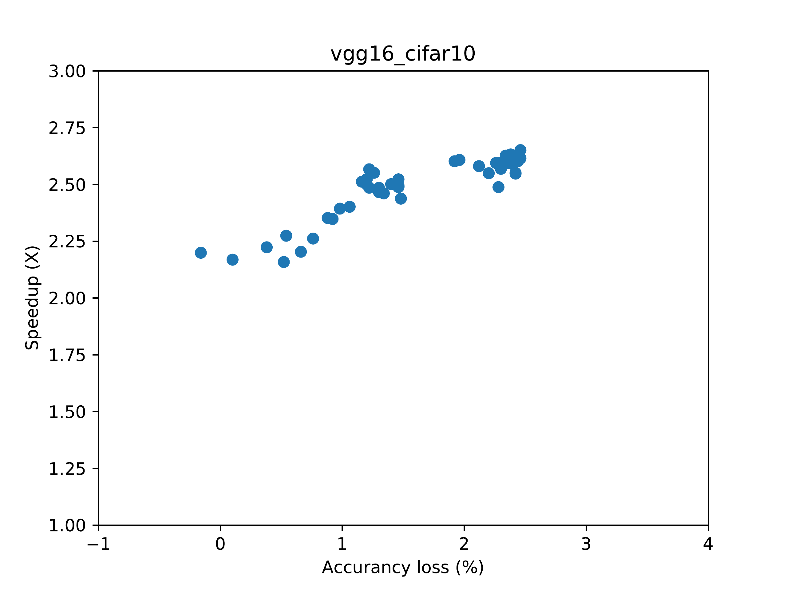

Getting Started
===============

This tutorial explains how to build and use HPVM.

* Before you proceed, check out the :doc:`build instruction for HPVM <build-hpvm>`.

To demonstrate the workflow,
we will generate a DNN model, VGG16 (for CIFAR10 dataset), into HPVM code, compile it with HPVM,
perform autotuning on the compiled binary to find approximation choices (configurations),
and profile the selected configurations to get real performance on device.
The result will be a figure showing the accuracy-performance tradeoff of VGG16 over the
(pre-defined) approximations and the configurations in a few formats.

* Please check ``test/dnn_benchmarks/model_params/`` exists and contains 
  ``vgg16_cifar10/`` and ``pytorch/vgg16_cifar10.pth.tar``,
  which may not be the case if you opted out of model parameter download in the installer.
  In that case, you may run the installer again to download the model parameters.
  It will not rebuild everything from scratch.

Generating and Compiling a DNN Model
------------------------------------

Below we will use `torch2hpvm`, the PyTorch API as an example.
This package lives at ``projects/torch2hpvm`` and should have been installed by the installer.
The Keras frontend serves a similar purpose, and its usage can be found in the
:doc:`documentation </components/keras-frontend>`.

**Note** that below we'll be working under directory ``test/dnn_benchmarks``,
for easier access to ``test/dnn_benchmarks/model_params/``.
You can also symlink it to other locations -- don't move it: it's used in test cases --
and adjust the paths below accordingly.

First, prepare 2 datasets for autotuning and testing for VGG16.
These datasets are provided as ``model_params/vgg16_cifar10/{tune|test}_{input|labels}.bin``,
where ``tune`` and ``test`` prefixes signify tuning and testing set.

.. code-block:: python

   from torch2hpvm import BinDataset
   from pathlib import Path

   data_dir = Path("model_params/vgg16_cifar10")
   dataset_shape = 5000, 3, 32, 32  # NCHW format.
   tuneset = BinDataset(data_dir / "tune_input.bin", data_dir / "tune_labels.bin", dataset_shape)
   testset = BinDataset(data_dir / "test_input.bin", data_dir / "test_labels.bin", dataset_shape)

`BinDataset` is a utility `torch2hpvm` provides for creating dataset over binary files.
Any instance of `torch.utils.data.Dataset` can be used here.

**Note** that each `module` is bound to 2 datasets: a "tune" and a "test" set.
The generated binary accepts an argument to be either the string "tune" or "test",
and performs inference over a dataset accordingly.

Create a DNN `module` and load the checkpoint:

.. code-block:: python

   import torch
   from torch.nn import Module
   from pytorch import dnn  # Defined at `hpvm/test/dnn_benchmarks/pytorch/dnn`

   model: Module = dnn.VGG16Cifar10()
   checkpoint = "model_params/pytorch/vgg16_cifar10.pth.tar"
   model.load_state_dict(torch.load(checkpoint))

Any `torch.nn.Module` can be similarly used,
as long as they only contain the tensor operators supported in HPVM.
See "Supported Operators" in :doc:`PyTorch frontend </components/torch2hpvm>`
and :doc:`Keras frontend </components/keras-frontend>`.

Now we are ready to export the model. The main functioning class of `torch2hpvm` is `ModelExporter`:

.. code-block:: python

   from torch2hpvm import ModelExporter

   output_dir = Path("./vgg16_cifar10")
   build_dir = output_dir / "build"
   target_binary = build_dir / "vgg16_cifar10"
   batch_size = 500
   conf_file = "hpvm-c/benchmarks/vgg16_cifar10/data/tuner_confs.txt"
   exporter = ModelExporter(model, tuneset, testset, output_dir, config_file=conf_file)
   exporter.generate(batch_size=batch_size).compile(target_binary, build_dir)

`output_dir`, `build_dir`, and `target_binary` define the folder for code generation, compilation,
and path to the compiled binary respectively.
`batch_size` is the batch size the binary uses during inference.

* **Note** that `conf_file` is the path to an HPVM approximation configuration file.
  This file decides what approximation the binary will use during inference.
  This path is hardcoded into the binary and is only read when the binary starts,
  so it's fine to have `conf_file` point to a non-existing path.
  An example can be found at ``hpvm-c/benchmarks/vgg16_cifar10/data/tuner_confs.txt``.

* `exporter.generate` generates the HPVM-C code while `exporter.compile` is
  a helper that invokes the HPVM compiler for you.

Now there should be a binary at ``./vgg16_cifar10/build/vgg16_cifar10``.
Running it without argument will perform an inference over the test set.
(The accuracy of inference is written to the file ``./final_accuracy``.)

Compiling a Tuner Binary
------------------------

The previous binary is used for inference purpose.
To use the autotuner, we need a slightly different binary that can talk with the tuner.
The following code is almost identical to the last code block, 
but it adds `target="hpvm_tensor_inspect"` to `ModelExporter`,
to require an autotuner binary.
It also doesn't require a `conf_file` argument.

.. code-block:: python

   from torch2hpvm import ModelExporter

   tuner_output_dir = Path("./vgg16_cifar10_tuner")
   tuner_build_dir = tuner_output_dir / "build"
   tuner_binary = tuner_build_dir / "vgg16_cifar10"
   exporter = ModelExporter(model, tuneset, testset, tuner_output_dir, target="hpvm_tensor_inspect")
   metadata_file = tuner_output_dir / exporter.metadata_file_name
   exporter.generate(batch_size=500).compile(tuner_binary, tuner_build_dir)

This binary is generated at ``vgg16_cifar10_tuner/build/vgg16_cifar10``.
It waits for autotuner signal and doesn't run on its own, so don't run it by yourself.
Instead, import the tuner `predtuner`, and tell the path to the binary (`tuner_binary`) to the tuner to use it:

.. code-block:: python

   from predtuner import PipedBinaryApp, config_pylogger

   # Set up logger to put log file in /tmp
   msg_logger = config_pylogger(output_dir="/tmp", verbose=True)

   # Create a `PipedBinaryApp` that communicates with HPVM bin.
   # "TestHPVMApp" is an identifier of this app (used in logging, etc.) and can be anything.
   # Other arguments: 
   #   base_dir: which directory to run binary in (default: the dir the binary is in)
   #   qos_relpath: the name of accuracy file generated by the binary.
   #     Defaults to "final_accuracy". For HPVM apps this shouldn't change.
   #   model_storage_folder: where to put saved P1/P2 models.
   app = PipedBinaryApp(
      "TestHPVMApp",
      tuner_binary,
      metadata_file,
      # Where to serialize prediction models if they are used
      # For example, if you use p1 (see below), this will leave you a
      # tuner_results/vgg16_cifar10/p1.pkl
      # which can be quickly reloaded the next time you do tuning with
      model_storage_folder="tuner_results/vgg16_cifar10",
   )
   tuner = app.get_tuner()
   tuner.tune(
      max_iter=1000,  # Number of iterations in tuning. In practice, use at least 5000, or 10000.
      qos_tuner_threshold=3.0,  # QoS threshold to guide tuner into
      qos_keep_threshold=3.0,  # QoS threshold for which we actually keep the configurations
      is_threshold_relative=True,  # Thresholds are relative to baseline -- baseline_acc - 3.0
      take_best_n=50,  # Take the best 50 configurations,
      cost_model="cost_linear",  # Use linear performance predictor
      qos_model="qos_p1",  # Use P1 QoS predictor
   )
   fig = tuner.plot_configs(show_qos_loss=True)
   fig.savefig("configs.png", dpi=300)
   app.dump_hpvm_configs(tuner.best_configs, "hpvm_confs.txt")

* **Note** that the performance shown here is estimated.
  ``cost_model="cost_linear"`` estimates the performance of a configuration
  using the FLOPs of each operator and the FLOPs reduction of each approximation.
  The next section talks about profiling (on a different machine),
  which shows the real performance.

  * If you are tuning on the end device that you wish to run the inference on, (which is a rare case),
    then removing this argument will make the tuner measure real performance instead.
    In that case, you may skip the profiling step.

* Arguments `cost_model` and `qos_model` controls the models used in tuning.
  No models are used when the argument is omitted.
  For example, you can do an empirical tuning run by removing `qos_model="qos_p1"`.

* The `metadata_file` variable passed to the tuner is the path to a metadata file generated by the frontend;
  the tuner reads it to know how many operators are there and what are the applicable knobs to each operator.

This tuning process should take a few minutes to half an hour,
depending on your GPU performance.
After the tuning finishes, the tuner will

* generate a figure showing the performance-accuracy tradeoff, at ``./configs.png``, and
* save the HPVM config format (write-only) at ``./hpvm_confs.txt``.

It is also possible to save the configuration in other formats
(see the `predtuner documentation <https://predtuner.readthedocs.io/en/latest/index.html>`_).

.. _target-profiling:

Profiling the Configurations on Target Device
---------------------------------------------

We will use `hpvm_profiler` (a Python package) for profiling the ``./hpvm_confs.txt``
we obtained in the tuning step.

* The profiler uses the *plain* binary generated in the beginning (``./vgg16_cifar10/build/vgg16_cifar10``)
  instead of the tuner binary.

* **Note** that you may want to run this profiling step on the edge device
  where the performance gain is desired.
  As the compiled binary is usually not compatible across architectures,
  you need to install HPVM on the edge device and recompile the model.
  You may also want to :ref:`skip Python packages in the installation <skip-pypkg>`
  to reduce some constraints on Python version and Python packages.

* **Also note** that currently,
  the approximation implementations in the tensor runtime are tuned for Jetson TX2,
  and speedup may be less for other architectures.

.. code-block:: python

   from hpvm_profiler import profile_config_file, plot_hpvm_configs

   # Set `target_binary` to the path of the plain binary.
   target_binary = "./vgg16_cifar10/build/vgg16_cifar10"
   # Set `config_file` to the config file produced in tuning, such as "hpvm_confs.txt".
   config_file = "hpvm_confs.txt"
   out_config_file = "hpvm_confs_profiled.txt"
   profile_config_file(target_binary, config_file, out_config_file)
   plot_hpvm_configs(out_config_file, "configs_profiled.png")

``hpvm_confs_profiled.txt`` contains the profiled configurations in HPVM format,
while ``configs_profiled.png`` shows the final performance-accuracy tradeoff curve.

An example of ``configs_profiled.png`` looks like this (proportion of your image may be different):

-----------------------

This concludes the whole workflow of HPVM.
For more detailed usages, check out the documentation of each component listed
:doc:`here </components/index>`.
