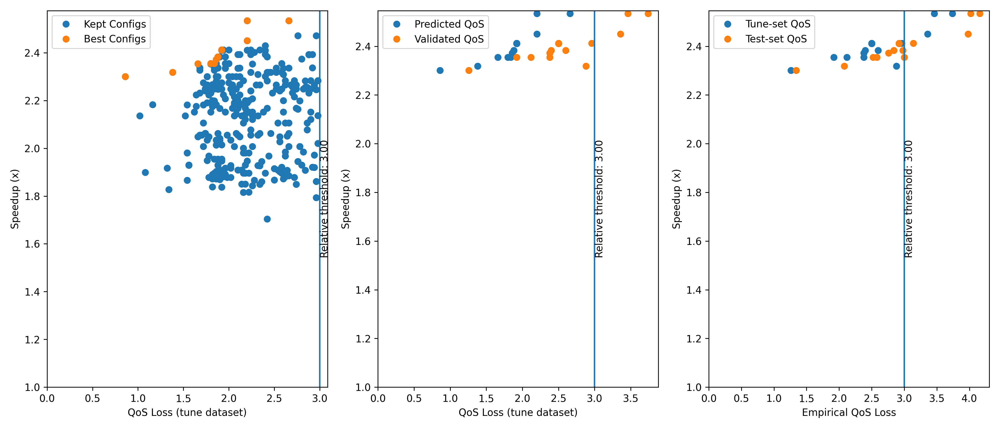

Getting Started
===================

This guide can help you start working with PredTuner.

Installation
------------

* PredTuner requires ``python >= 3.6`` and ``pip``, preferrably ``pip >= 20``.

To install this package from source, at the root directory of this repository, do:

.. code-block:: shell

   python3 -m pip install -e ./

PredTuner will also be available on PyPi in the future after we publish the first release.

* With the flag ``-e``, any changes to code in this repo is reflected on the installed version automatically.
  It can be omitted if you don't intend to modify the code in this package.

Model Data for Example / Testing
^^^^^^^^^^^^^^^^^^^^^^^^^^^^^^^^

PredTuner contains 10 demo models which are also used in tests.

* Download and extract `this <https://drive.google.com/file/d/1V_yd9sKcZQ7zhnO5YhRpOsaBPLEEvM9u/view?usp=sharing>`_ file containing all 10 models, for testing purposes.
* In the tutorial below, we will only use VGG16-CIFAR10.
  If you don't need the other models, get the data for VGG16-CIFAR10
  `here <https://drive.google.com/file/d/1Z84z-nsv_nbrr8t9i28UoxSJg-Sd_Ddu/view?usp=sharing>`_.

In either case, there should be a ``model_params/`` folder at the root of repo after extraction.

Tuning a PyTorch DNN
--------------------

* The code used in the following example can be found at ``examples/tune_vgg16_cifar10.py``.

PredTuner can tune any user-defined application,
but it is optimized for tuning DNN applications defined in PyTorch.

We will use models predefined in PredTuner for demonstration purposes.
Download pretrained VGG16 model parameters and CIFAR10 dataset from `here
<https://drive.google.com/file/d/1Z84z-nsv_nbrr8t9i28UoxSJg-Sd_Ddu/view?usp=sharing>`_.
After extraction, there should be a ``model_params/`` folder in current directory.

Load the tuning and test subsets of CIFAR10 dataset, and create a pretrained VGG16 model:

.. code-block:: python
  
  from pathlib import Path
  import predtuner as pt
  from predtuner.model_zoo import CIFAR, VGG16Cifar10

  prefix = Path("model_params/vgg16_cifar10")
  tune_set = CIFAR.from_file(prefix / "tune_input.bin", prefix / "tune_labels.bin")
  tune_loader = DataLoader(tune_set, batch_size=500)
  test_set = CIFAR.from_file(prefix / "test_input.bin", prefix / "test_labels.bin")
  test_loader = DataLoader(test_set, batch_size=500)

  module = VGG16Cifar10()
  module.load_state_dict(torch.load("model_params/vgg16_cifar10.pth.tar"))

PredTuner provides a logging mechanism.
While not required, it's recommended that you set up the logger output into a file:

.. code-block:: python

  msg_logger = pt.config_pylogger(output_dir="vgg16_cifar10/", verbose=True)

For each tuning task, both a tuning dataset and a test dataset is required.
The tuning dataset is used to evaluate the accuracy of application in the autotuning stage,
while the test dataset is used to evaluate configurations found in autotuning.
This is similar to the split between training and validation set in machine learning tasks.
In this case, both tuning and test datasets contain 5000 images.

Create an instance of `~predtuner.torchapp.TorchApp` for tuning PyTorch DNN:

.. code-block:: python

  app = pt.TorchApp(
    "TestTorchApp",  # Application name -- can be anything
    module,
    tune_loader,
    test_loader,
    knobs=pt.get_knobs_from_file(),
    tensor_to_qos=pt.accuracy,
    model_storage_folder="vgg16_cifar10/",
  )

PredTuner provides `~predtuner.torchapp.TorchApp`,
which is specialized for the use scenario of tuning PyTorch DNNs.
In addition, two more functions from PredTuner are used:

:py:meth:`pt.accuracy <predtuner.torchutil.accuracy>`
is the *classification accuracy* metric,
which receives the probability distribution output from the VGG16 model,
compare it to the groundtruth in the dataset,
and returns a scalar between 0 and 100 for the classification accuracy.

:py:meth:`pt.get_knobs_from_file <predtuner.approxes.get_knobs_from_file>`
returns a set of approximations preloaded in PredTuner,
which are applied to `torch.nn.Conv2d` layers.

Now we can obtain a tuner object from the application and start tuning.
We will keep configurations that don't exceed 3% loss of accuracy,
but encourage the tuner to find configurations with loss of accuracy below 2.0%.

.. code-block:: python

  tuner = app.get_tuner()
  tuner.tune(
    max_iter=1000,
    qos_tuner_threshold=2.0,  # QoS threshold to guide tuner into
    qos_keep_threshold=3.0,  # QoS threshold for which we actually keep the configurations
    is_threshold_relative=True,  # Thresholds are relative to baseline -- baseline_acc - 2.0
    take_best_n=20,
    cost_model="cost_linear",  # Use linear cost predictor
  )

**QoS** (quality of service) is a general term for the quality of application after approximations are applied;
e.g., here it refers to the accuracy of DNN over given datasets.
We will be using the term QoS throughout the tutorials.

:py:meth:`tuner.tune <predtuner.modeledapp.ApproxModeledTuner.tune>`
is the main method for running a tuning session.
It accepts a few parameters which controls the behavior of tuning.
`max_iter` defines the number of iterations to use in autotuning.
Within 1000 iterations, PredTuner should find about 200 valid configurations.
PredTuner will also automatically mark out `Pareto-optimal
<https://en.wikipedia.org/wiki/Pareto_efficiency>`_
configurations.
These are called "best" configurations (`tuner.best_configs`),
in contrast to "valid" configurations which are the configurations that satisfy our accuracy requirements
(`tuner.kept_configs`).
`take_best_n` allows taking some extra close-optimal configurations in addition to Pareto-optimal ones.

1000 iterations is for demonstration; in practice,
at least 10000 iterations are necessary on VGG16-sized models to converge to a set of good configurations.
Depending on hardware performance, this tuning should take several minutes to several tens of minutes.

Saving Tuning Results
---------------------

Now the `tuner` object holds the tuning results,
we can export it into a json file,
and visualize all configurations in a figure:

.. code-block:: python

  tuner.dump_configs("vgg16_cifar10/configs.json", best_only=False)
  fig = tuner.plot_configs(show_qos_loss=True)
  fig.savefig("vgg16_cifar10/configs.png")

The generated figure should look like this:

where the blue points shows the QoS and speedup of all valid configurations,
and the "best" configurations are marked out in orange.

Autotuning with a QoS Model
-------------------------------------

The previous tuning session shown above is already slow, 
and will be much slower with larger models, more iterations, and multiple tuning thresholds.
Instead, we can use a *QoS prediction model* which predicts the QoS,
with some inaccuracies, but much faster than running the application.
To do that, simply use the argument `qos_model` when calling `tuner.tune()`:

.. code-block:: python

  tuner = app.get_tuner()
  tuner.tune(
    max_iter=1000,
    qos_tuner_threshold=2.0,  # QoS threshold to guide tuner into
    qos_keep_threshold=3.0,  # QoS threshold for which we actually keep the configurations
    is_threshold_relative=True,  # Thresholds are relative to baseline -- baseline_acc - 2.0
    take_best_n=20,
    cost_model="cost_linear",  # Use linear cost predictor
    qos_model="qos_p1"
  )

The QoS model will first undergo a initialization stage (takes a bit of time),
when it learns about the behavior of each knob on each operator (DNN layer).
Because the configurations will end up with predicted QoS values after tuning,
this will add a *validation* stage at the end of tuning where the QoS of best configurations are empirically measured,
and the bad ones are removed.

Following the procedure above to plot a figure of the configurations,
the generated figure should look like this,
with one extra subfigure (middle) comparing the predicted and measured QoS.

----------------------------------------------------------

This concludes the tutorial for installing and using PredTuner.
What we have just used is the PyTorch API of PredTuner.
:doc:`reference/index` shows the reference of this API along with two sets of lower-level APIs
that allows tuning applications that are not PyTorch DNN.
